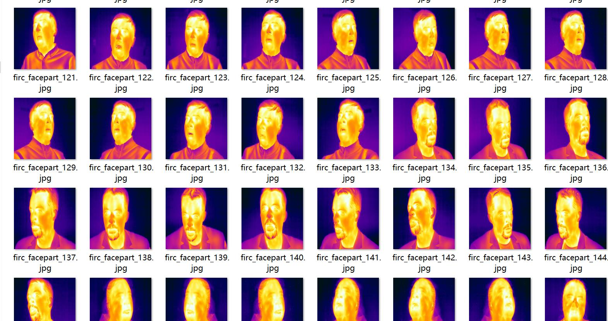
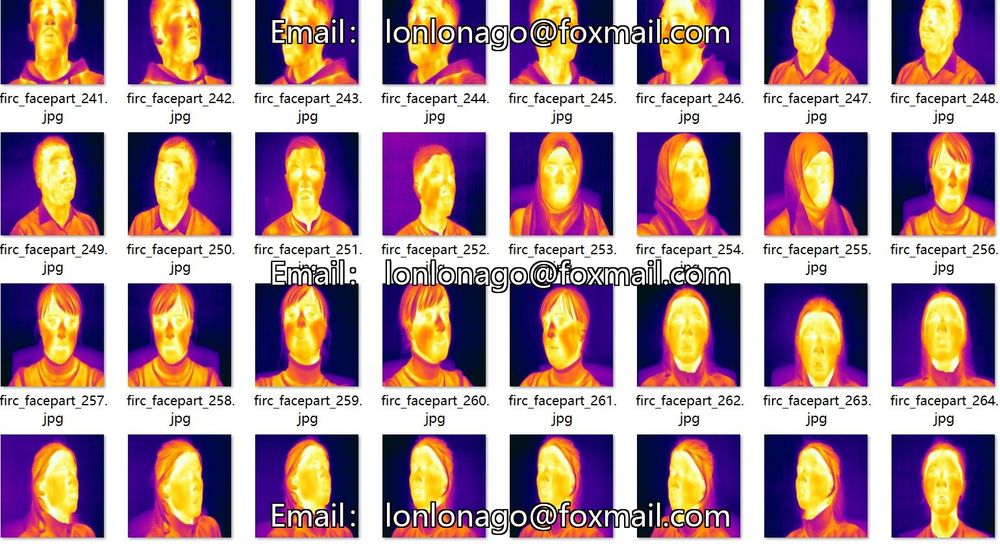
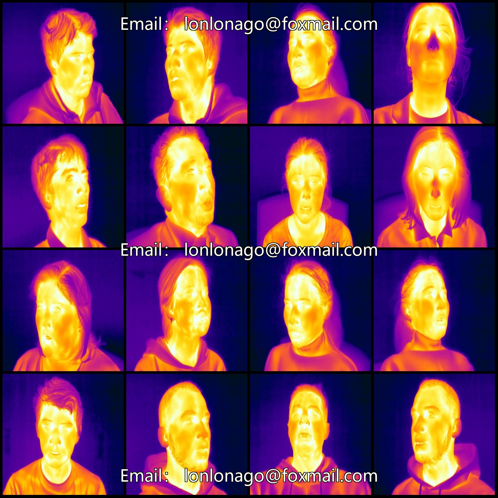
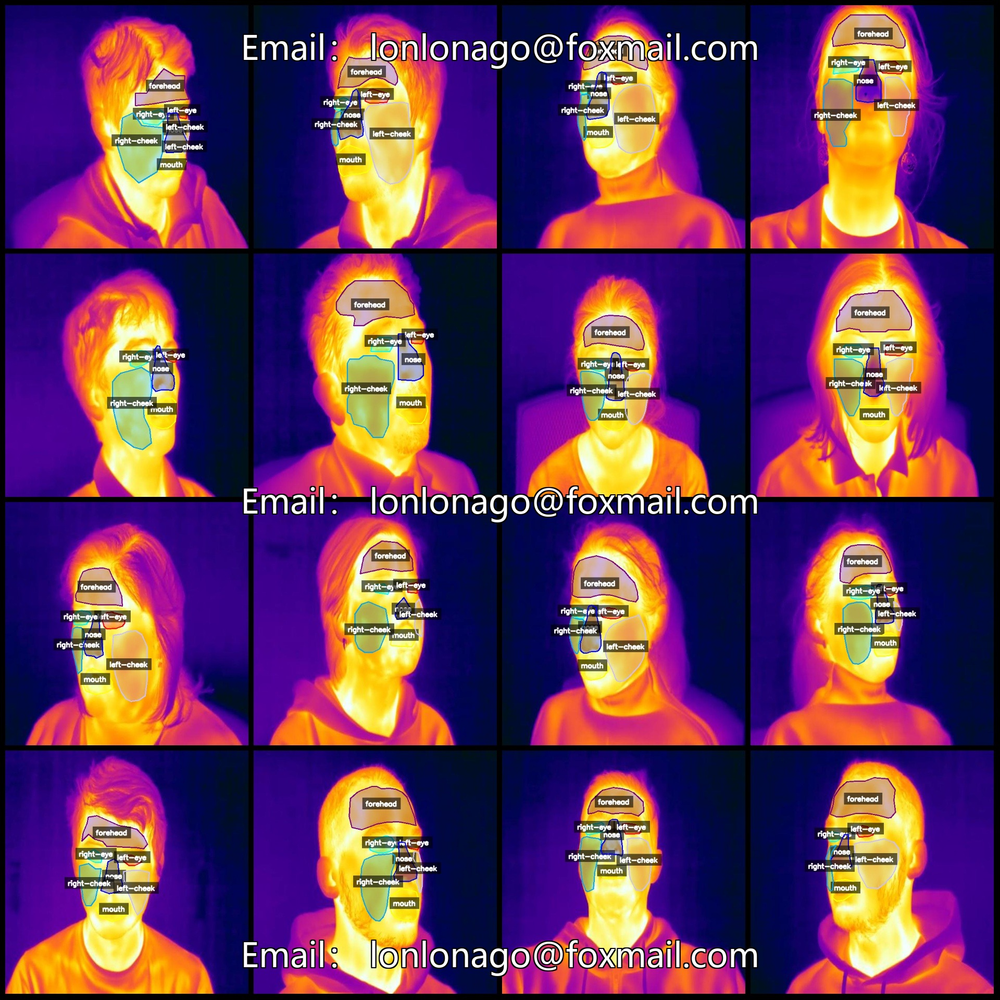
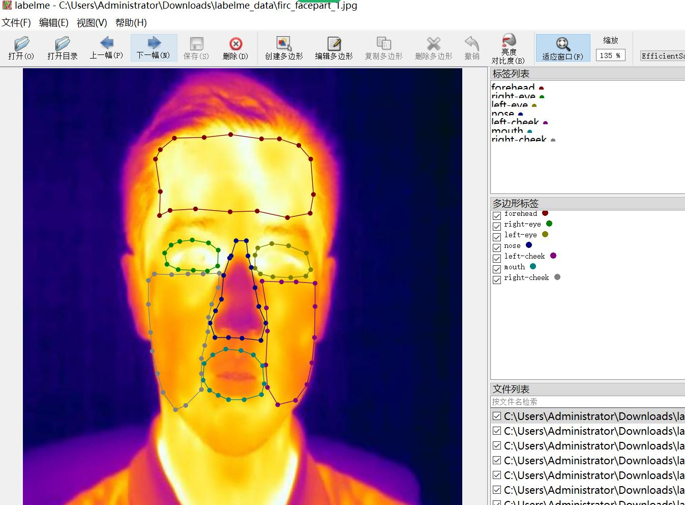

# Infrared Image Face Components and Facial Parts Identification and Segmentation Dataset - LabelMe Format with 886 Categories

Dataset format: LabelMe format (excluding mask files, only containing JPG images and corresponding JSON files)
Number of images (number of JPG files): 886
Number of labeled files (JSON files): 886
Number of labeled categories: 7
Labeled categories: ["forehead", "left-cheek", "left-eye", "mouth", "nose", "right-cheek", "right-eye"]
Each category labeled boxes count:
forehead (forehead) count = 814
left-cheek (left cheek) count = 693
left-eye (left eye) count = 910
mouth (mouth) count = 843
nose (nose) count = 880
right-cheek (right cheek) count = 833
right-eye (right eye) count = 789
Total box count: 5762

Used labeling tool: labelme=5.5.0
Image resolution: 640x640
Labeling rules: Polygon for each category is drawn
Important note: The dataset can be opened and edited in LabelMe, but the JSON dataset needs to be converted into either mask, Yolo or COCO format for segmentation or instance segmentation.
Special declaration: This dataset does not guarantee any accuracy of the trained models or weight files.

Image preview:

Examples of labeled images:

Labeled drawing results:

LabelMe editing example image:

## Images

Here is a pay link on Stripe ( https://buy.stripe.com/3cs8yP7sY87d0vu9AB ). Please contact me lonlonago@foxmail.com after funding $89, and I will send you a complete data files , thank you!

